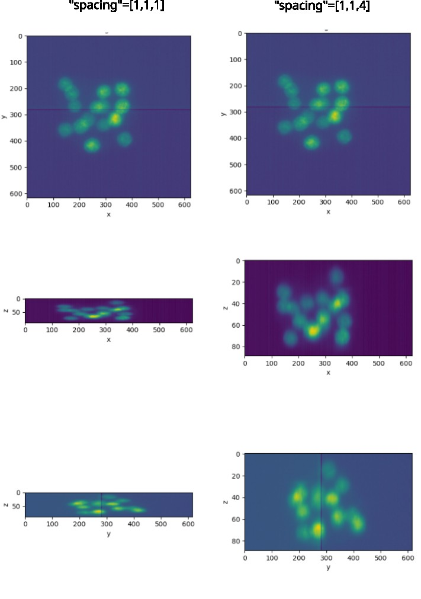
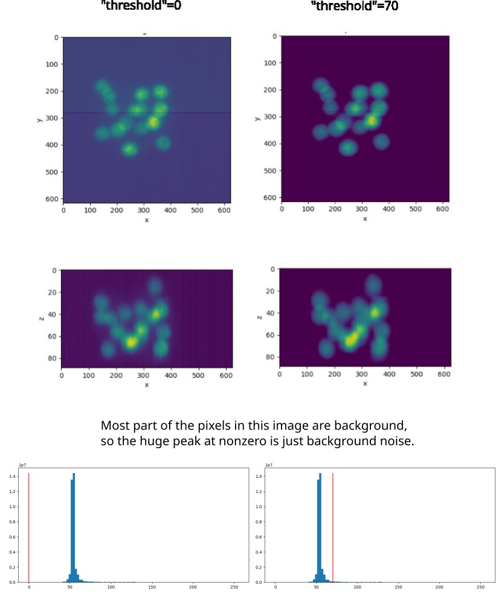
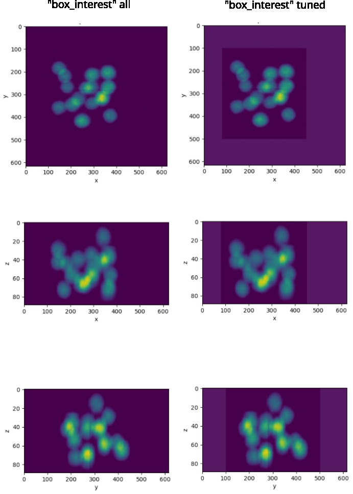

# registration_sitk

This script uses SimpleITK to perform registration of movies.

## Content

 - `requitements.txt`: Set of packages to run the script and to use a virtual environment.
 - `sitk_recording.py`: Script file for batch recording. 

## Setting up

You can make a virtual environment

```
conda create -n sitk_registration
```

activate the environment:

```
conda activate sitk_registration
```

and, once inside the environment, install the required packages:

```
pip install -r requirements.txt
```

You should be ready to go!

## How to use this script

In the following, we describe the pipeline of analysis of an image using this script.

### 0. Starting point of the analysis

The start point of the analysis is to have a folder in which you have a video recording separated by ordered time points in any format. This should look like:

```
./myvideofolder/
    frame1.tiff    
    frame2.tiff    
    frame3.tiff    
    frame4.tiff
    ...    
```

The format of the recording can be `.tiff` or any other compatible format with [SimpleITK](https://simpleitk.readthedocs.io/en/master/IO.html).

### 1. Execute the setup

The first step is to create the analysis folder. For that, we use the flag `-s` or `--setup`.

```
python sitk_recording.py myvideofolder -s
```

In case you already had performed this step, an error will be raised. In case you want to erase the previous results, just execute `-sf` or `--setupforce`. This will remove the existing file and will make a new one.

```
python sitk_recording.py myvideofolder -sf
```

This step basically generated a new folder called `myvideofolder_output` in your directory with the following structure:

 - myvideofolder_output/
   - preanalysis/
     - plots/
     - results/
   - analysis/
     - transforms/
     - results/
   - `parameters.json`

In these folders, all the information from the different steps of the analysis will be saved. We will explain their contents in the next sections.

For now, you can see that the file `parameters.json` contains all the parameters of the analysis. We can check the first ones under the key `files`:

```
{
  "files": {
    "dimensions": 3,
    "width": 624,
    "height": 616,
    "depth": 89,
    "channels": 1,
    "n_files": 2
  },
  ...
}
```

These parameters describe the shape of the data in your folder, their dimensions and the number of files present in the folder. In principle, it will not be necessary that you touch them, and only you will be required to do so if for any reason were not correctly read from the file.

## 2. Preanalysis

The preanalysis step defines some parameters to preprocess the imaging before recording.

For that, we run with the flags `-pa` or `--preanalysis`:

```
python sitk_recording.py myvideofolder -pa
```

The results of this step are saved in `preanalysis/plots/...`. The the following procedures are performed in this step:

 1. Scaling appropriately the `x`, `y` and `z` spacing distances when imaging sampling is not homogeneous. This can be done by changing the parameter `preanalysis/spacing` in the `parameters.js` file.



 2. (Optional) Removing the background noise. We can put a threshold on the background noise distribution and set all these pixels to zero. This can be set by tuning `preanalysis/threshold`. You can use the histogram plots to decide an appropriate threshold.



 3. (Optional) Focusing the image in the region of interest. This is done by tuning `preanalysis/box_interest`. The box has to be set to contain all the relevant regions at all time points.



There are several additional parameters that can be used but are for efficientcy purposes only:

 - `preanalysis/sample_each_n_frames`: Tune this parameter to generate plots of files in the folder spaced by this number. The larger the value, the less files that will be processed.
 - `preanalysis/pixel_downsample`: Tune this array to only plot pixels spaced by these spacings. The larger the downsample, the smaller the figures generated.
 - `preanalysis/n_hist_bins`: Use this parameter to coarse grain or fine tune the histograms of pixel intensity used to threshold.

## 3. Analysis